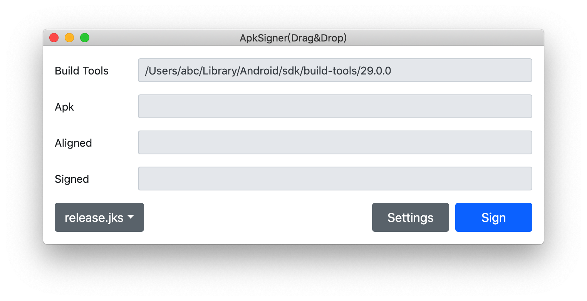

# ApkSigner

Once I could not find an APK signing gui tool on Mac, so I wrote this electron app,
with keystore list configuration.

## Usage

The app reads system env **ANDROID_HOME** to determine android sdk location, make
sure you set it up.

## Package

electron-packager . --overwrite --out ./bin/ --icon ./assets/icons/icon.icns
